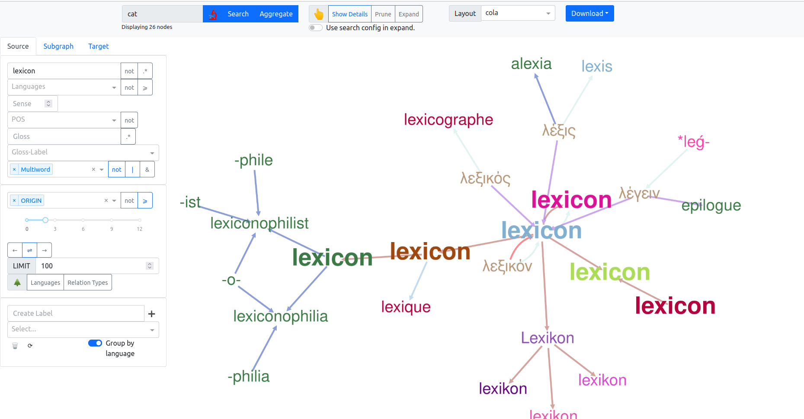

# etymmap

Etymology from the Wiktionary in a Graph-App.

## What is etymmap?

Etymmap is a framework for extracting, analyzing and reducing etymology data from the English wiktionary.
Also, the resulting etymological graph can be interactively explored in a graph app.

The project consists of three parts:

1. etymmap library: extraction and common functionality
2. notebooks: statistical analyses of the historical dump and detailed analysis of a current dump
3. fronted: the app, based on [dash_cytoscape](https://dash.plotly.com/cytoscape) and backed
   by [neo4j](https://neo4j.com/)

## Getting started

You can either extract the most recent dump yourself or use the demo data, if you just want to try out the app.



### Setup

Project dependencies are managed with [poetry](https://python-poetry.org/docs/#installation).
Also, if you want to use a fully local setup, you may want to
use [docker-compose](https://docs.docker.com/compose/install/) for hosting mongodb (for extraction) and neo4j (for the
app).

Checkout the project and install the dependencies.

```
git clone https://github.com/mkcode92/etymmap.git
cd etymmap
poetry install
```
If you only want to check out the app in docker with test data, you can also skip the poetry command.

### Extraction

To start with the extraction, you need a dump of the English wiktionary
from [here](https://dumps.wikimedia.org/enwiktionary/), for example
https://dumps.wikimedia.org/enwiktionary/20230101/enwiktionary-20230101-pages-articles.xml.bz2.

The extraction follows the steps:

1. articles are parsed and stored in a mongodb
    * wiktionary can then be accessed through `etymmap.wiktionary.Wiktionary`
2. the graph is extracted and stored as .gpickle binary
3. the graph is exported in one of the formats JSON, [lemon](https://lemon-model.net/) (RDF) or neo4j (specialized csv)

The last step requires a lot of ressources. If the entire lexicon is used, I recommend >= 12GB RAM.
The times are based on my intel i7 8x2.8GHz CPU.
For detailed usage, consult `etymmap -h` or `etymmap <subcommand> -h`.

1. dump -> mongodb (~ 15min)

If you use mongodb locally with `docker-compose up mongodb`, then the adress is `mongodb://localhost:27017`, which is
also the default for the CLI.

```
etymmap dump2mongo dumps/enwiktionary-20230101-pages-articles.xml.bz2
```

This creates a mongo-database `enwiktionary` with collection `20230101`.
You may use multiple workers for this.

2. graph extraction (~ 3 min for first 200k entries)

For the default usage:

```
etymmap extract --sections Etymology Descendants \
                --db-config mongodb://localhost:27017 enwiktionary 20230101 \
                --output enw200k.gpickle
                --head 200000
```

In the first run, this will also initialize an in-memory lexicon (i.e. index), which is cached in a
file `.lexicon.pickle` (see `--cache` parameter).
Node and relation unification is immedeatly applied, depending on parameter `--reduction` the graph is reduced:

* `full`: transitive reduction and unspecific edge pruning*
* `transitive`: only transitive reduction
* `off`: no reduction

Additionally, you can include `DerivedTerms` or `RelatedTerms` in the sections.
Of course, depending on your resources, you can also extract the complete graph, which takes around 10 times longer.

3. export the data (~ 5 min for first 200k)

```
etymmap export enw200k.gpickle -o .neo4j/import/enw200k --format neo4j \
                --db-config mongodb://localhost:27017 enwiktionary 20230101

```

This exports all nodes (+ data) and relations of the graph in a csv format suited for neo4j import.
The other available formats are `simple`, `json` and `lemon`.
This may take a while as most of the entries are only parsed now in order to export their node information (
pronunciation, etymology text and glosses/definitions).

*_Unspecific edge pruning_ means: all edges of type _related_ are removed unless they connect otherwise unconnected
components in the _origin_-subgraph.
The assumption is, that intra-component edges often describe a transitive etymological relation and are redundant.

### Exploration
1. Initialize neo4j

The app requires that the previously extracted data are available inside the neo4j database.
Neo4j must not be running when importing the data.
```
./import_neo4j.sh enw200k
```
`enw200k` is the directory that contains the exported data _inside the .neo4j folder that will also contain the database_.
You can also derive your own neo4j admin script from the given script if you prefer a different setup.

2. Start neo4j
```
export ETYMMAP_DATA=.neo4j/data ETYMMAP_PLUGINS=.neo4j/plugins && docker-compose up neo4j
```
This may need a moment, as the apoc plugin is installed.
With `ETYMMAP_DATA`, you specify where your previously compiled database lies.
`ETYMMAP_PLUGINS` specifies, where plugins are stored.

The graph data can now also be explored using the neo4j UI at `localhost:7474/browser`.

3. Start the app

The app uses `etymmap` as a library. You can build the wheel with
```
poetry build
```

Then, **either**

A: Start from within the code.
```
cd frontend
# setup environment
poetry install
# start the debug app server
poetry run python explorer/main.py
```

B: Run from within container:
```
# build etymmap library, which is used by app
poetry build . 

# build the docker image
docker build . -f frontend/Dockerfile -t etymmap-explorer:0.1.0

docker-compose up explorer
```

The app is available at port 8050.

### Explorer features


* Top-Navbar
    * Query
        * simple search
        * advanced search (toggled on 🔬)
        * aggregation on selected labels
    * Interaction
        * show pronunciation, etymology and glosses on click
        * prune nodes/ edges
        * expand neighbours or start query from clicked node
    * Layouts
        * select static and dynamic layouts
    * Download
      * download displayed graph as .json or .xlsx
      * download cypher history

* Advanced search
    * Specify Source, Subgraph or Target nodes
      * ⩾ : also select children
      * .*: use regex
      * \|, &: select nodes that have any of the labels ( \| ) or all ( & )
      * not: invert selection
    * Specify relation type
    * Specify search depth, direction of the relations and limit
      * !! be careful what your machine/browser can handle, if not sure,
        increase limit step by step.
        Search depth > 5 is not a good idea, as the graph is huge and very densly connected
      * make queries as specific as possible
    * Trees
      * Display language tree (combination of families and phylogenetic tree)
      * Display relation ontology
    * Labels
      * type a label and click "+" to set the label for all visible nodes
        * 🗑: delete selected labels
        * ⟳: reload node labels from database
      * select a label to include it in label aggregation
      * optionally also aggregate by language
      

## Details

The projects intends to make sense of etymological data as a graph.
This requires:

* a detailed ontology of etymological relations
* a lexeme-based model (i.e. one that distinguishes homonyms), otherwise some links and their transitive paths are just
  wrong (_manta ray_ is not derived from _ray_ "beam")
* non-redundancy:
    * through transitive reduction: A --> B --> C -> NOT (A --> C)
    * node unification

There are some challenges specific to the english wiktionary as the source of information:

* most etymological relations are expressed in particular markup entities, the **templates**.
  These can be used to extract a specific type and identify the participants of the relation.
  However, each template has to be parsed by it's own rules to extract a relation from it.
* not all articles use the templates, here a **rule-based** mechanism is used.
* redundancy: different sections encode overlapping graphs/trees.
    * many relations are specified at mulitple places
    * there are many _unspecific_ links between words that may be expressed _specific_ in other articles, here the most
      specific description has precedence
* linking: the target of a relation that is expressed by a template or wikilink has to be identifed, differentiating
  multiple meanings of a word, if necessary, by **comparing glosses**

----

Accompanying my master thesis "Erschließung etymologischer Daten des
Wiktionarys im Graphmodell" (_Aquisition of etymological data from the wiktionary through the graph model_) at
Universität Leipzig, Summer 2022.
